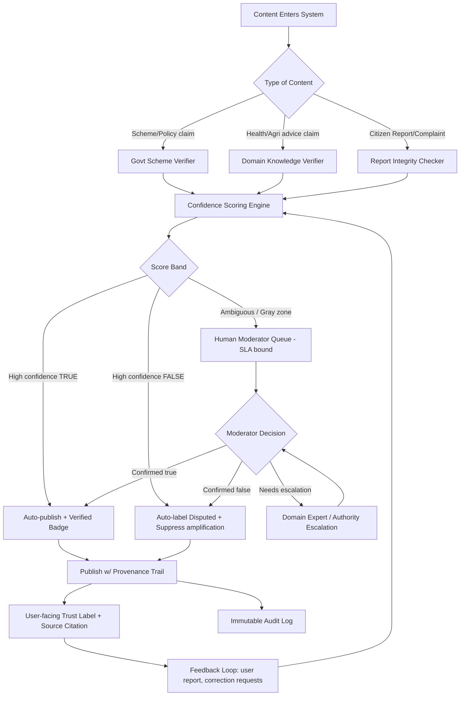

# The Bad Reading — Misinformation Defense System

## Problem, short

Platform = trust anchor for users. Three attack shape:
1. **Rumor spread** — false claim ("govt scheme fraud") spread faster than truth, users act on it (pull out).
2. **Bad advice forward** — WhatsApp-style forward, crop-disease "cure" claim, false, users apply it, crop damage follow.
3. **Coordinated fake report** — citizen complaint submitted, looks 100% legit, actually reputation-attack on rival, no human tell fake from real at intake.

Common root: system either (a) blind repeater of whatever come in, or (b) no mechanism to grade trust before publish/act.

## Core decision (defend this)

Platform NOT truth-arbiter, single-handed censor. Platform = **trust-layered pipeline**: every piece of content get provenance + confidence score before it influence any user decision. Low-confidence content never silently deleted — always labeled, routed, or held, never invisible-dropped without trace (avoid "shadow-ban" trust problem) and never auto-published as fact either.

Three defense pillars:
- **Source verification** — tie claim to authoritative system-of-record (govt API, agri-extension DB) where one exist.
- **Pattern/anomaly detection** — catch coordinated / bot-like / duplicate submission before human even see it.
- **Human-in-loop for ambiguous zone** — machine handle clear-cut cases (verified true / verified false), human handle gray zone, fast SLA.

No fully-automated take-down of user content. Full-auto block invite two failure: false-positive silence real complaint, false-negative let sophisticated fake through confident-looking. Hybrid safer, defensible, auditable.

## System Flow

## Layer breakdown

### 1. Intake / Signal extraction
Every submission tagged w/ metadata: submitter history, device/account age, submission velocity (same claim from many account, short window = coordination signal), geographic clustering, text similarity to known-false claims DB.

### 2. Domain-specific verifiers
- **Govt scheme claim** → cross-check against official scheme API/registry (if platform reference govt scheme, must maintain live link to source-of-truth, not cached static copy). Mismatch or scheme-not-found = auto-flag "unverifiable," never silently confirm.
- **Crop-disease/health claim** → cross-check against agri-extension / ICAR / verified agronomist knowledge base. Claim not in DB = route to expert queue, never auto-approve.
- **Citizen report** → integrity checker: check submission pattern (many report, short time, similar wording = coordinated attack signature), cross-reference complainant/target relationship (conflict-of-interest flag), require secondary evidence (photo geotag, timestamp, corroboration) before status "actionable."

### 3. Confidence scoring engine
Numeric score, not binary true/false. Combine: source-match strength + anomaly signal + historical submitter reliability + corroboration count. Score band decide route (auto-publish / auto-flag / human queue). Score + reasoning stored, visible to moderator (explainable, not black-box).

### 4. Human-in-loop queue
Only gray-zone hit human. SLA enforced (e.g. 4hr for scheme rumor, faster for health claim — harm-urgency weighted). Moderator see full evidence trail, not raw claim alone.

### 5. Escalation
Ambiguous-after-human case → forwarded to domain authority (scheme officer, agri extension officer, platform trust & safety). Escalation itself logged, closes loop back to scoring engine (system learn).

### 6. Publish layer — labeling, not deletion
Every item ship w/ visible trust label: **Verified** (source-linked) / **Disputed** (evidence against, shown w/ counter-source) / **Unverified — pending review**. Never delete false content silently — label + explain + link correction. Transparency build long-term trust more than invisible removal (removal w/o reason breed distrust, conspiracy).

### 7. Feedback loop
User can flag, correction request tracked. High-confidence-false items ranked lower / de-amplified (not deleted) in feed algorithms — friction slow spread w/o triggering "censorship" backlash.

### 8. Audit trail
Immutable log: who submitted, what checks ran, what score, who decided, when. Needed for dispute resolution, legal defensibility, and detecting if verifiers themselves get gamed over time.

## Scenario walkthrough

**Govt scheme rumor**: claim enter → C1 verifier hit live govt API → API confirm scheme active/legit → score HIGH-TRUE → auto-publish w/ "Verified — source: [Ministry link]" badge → rumor thread auto-labeled Disputed, counter-source attached, algorithmically de-ranked.

**Crop-disease WhatsApp forward**: claim reach platform (via user report or ingest) → C2 verifier check agri-extension DB → treatment not validated / contradicts known guidance → score HIGH-FALSE → labeled Disputed + correct treatment shown alongside → surfaced to users in same groups if platform has proactive-correction channel.

**Fake citizen report**: submission pattern show 6 similar complaints, 6 new accounts, 10-min window, no photo evidence → anomaly signal HIGH → routed straight to moderator queue (never auto-actioned against target) → moderator require corroboration before status change → target not penalized on unverified report alone.

## Why this design defensible

- Never single point of automated censorship — avoid over-block harm.
- Never blind pass-through — avoid platform-as-megaphone-for-lies harm.
- Every decision explainable + reversible (score + evidence trail visible).
- SLA-bound human review = scale problem NOT ignored, but NOT fully outsourced to opaque AI either.
- Labeling > deleting = preserve user trust, avoid "platform hiding stuff" narrative.
- Coordinated-attack detection happen BEFORE content treated as legitimate input, not after damage done.
